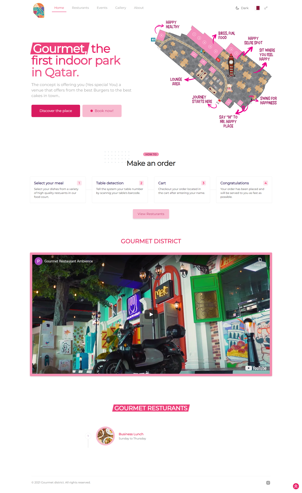
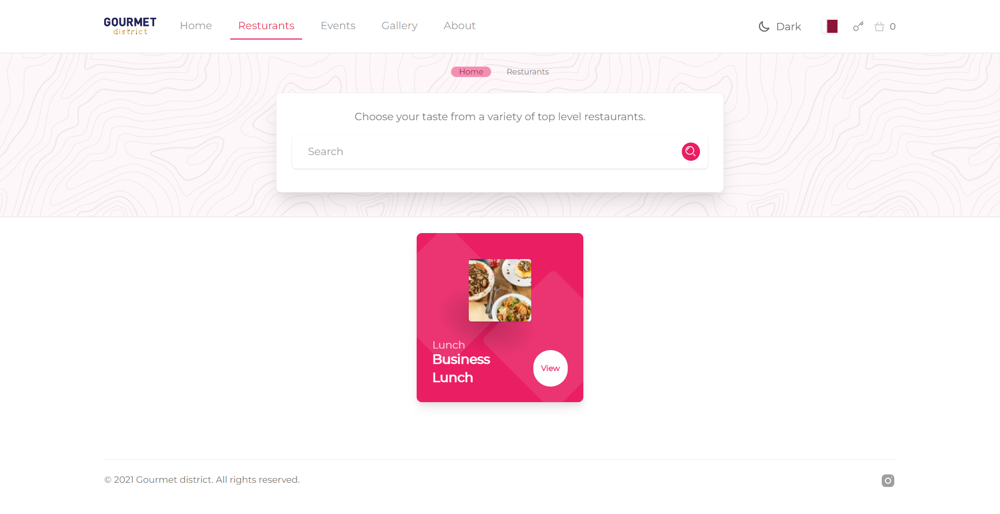
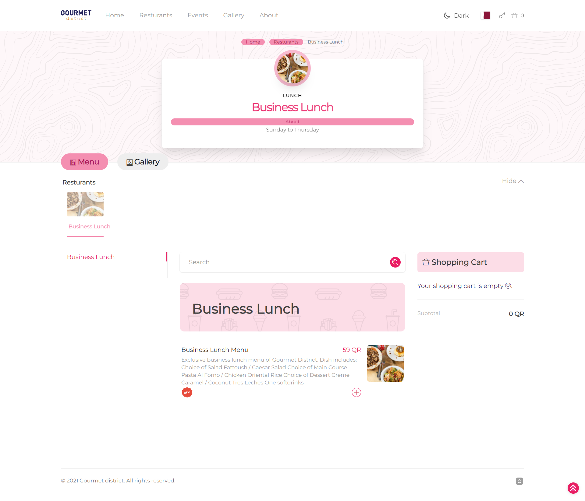

# Gourmet District `Ordering Web App`
Real-time dine-in ordering progressive web app using Nuxt.js, Tailwind CSS, Laravel as an API, and Pusher for web sockets.



---



---



---


**API Repository**: [Gourmet API on GitHub](https://github.com/mo3ly/gourmet-api)

## Build Setup

```bash
# install dependencies
$ npm install

# serve with hot reload at localhost:3000
$ npm run dev

# build for production and launch server
$ npm run build
$ npm run start

# generate static project
$ npm run generate
```
